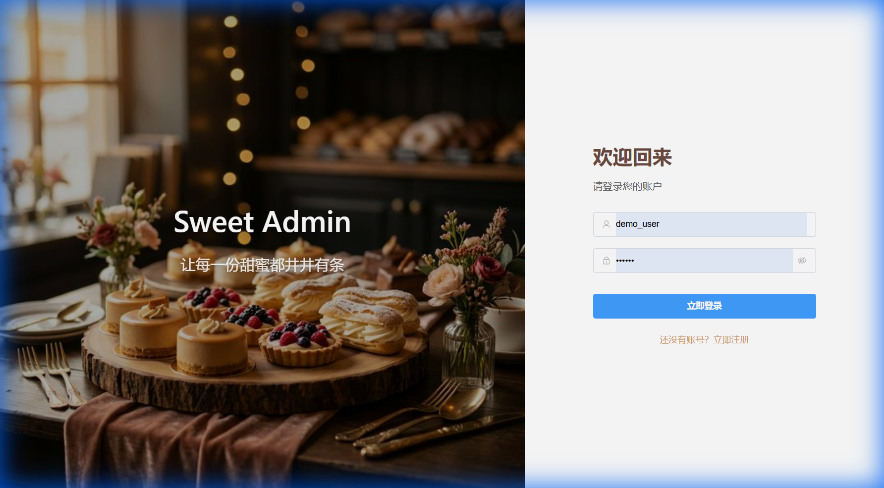
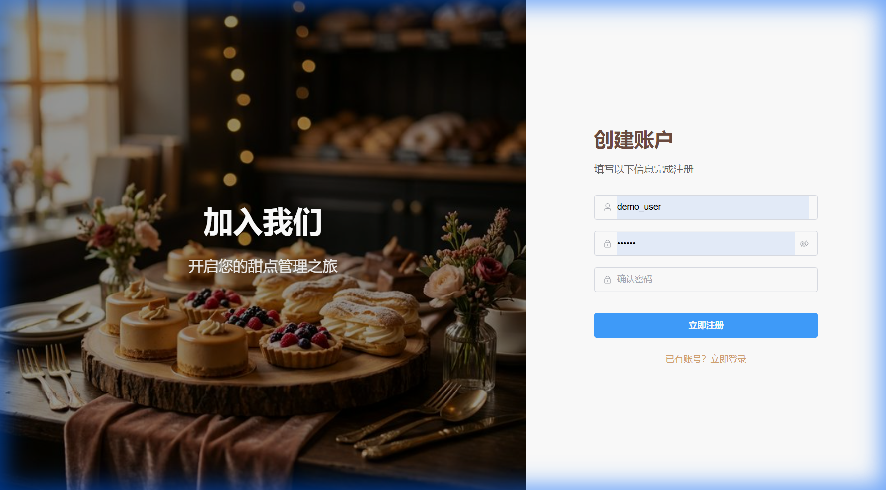
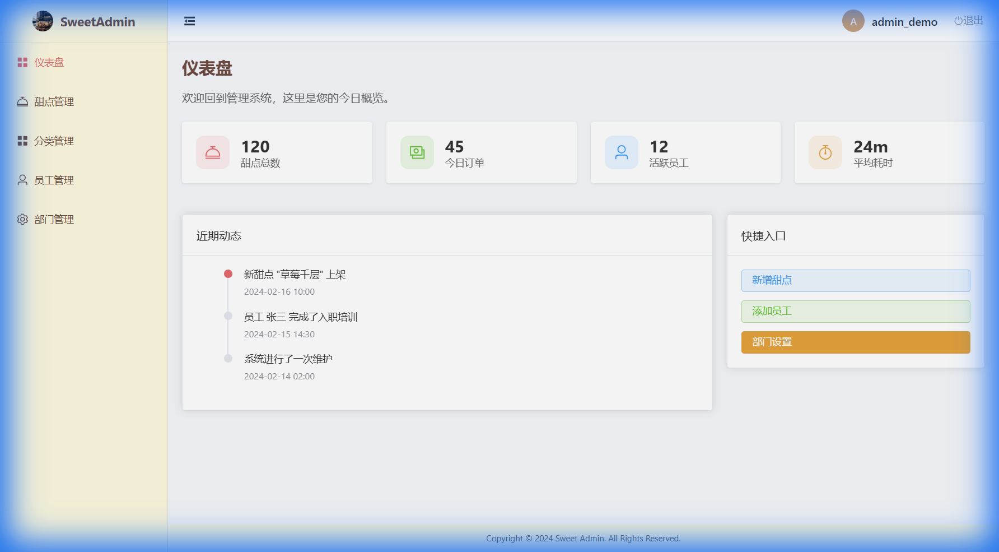
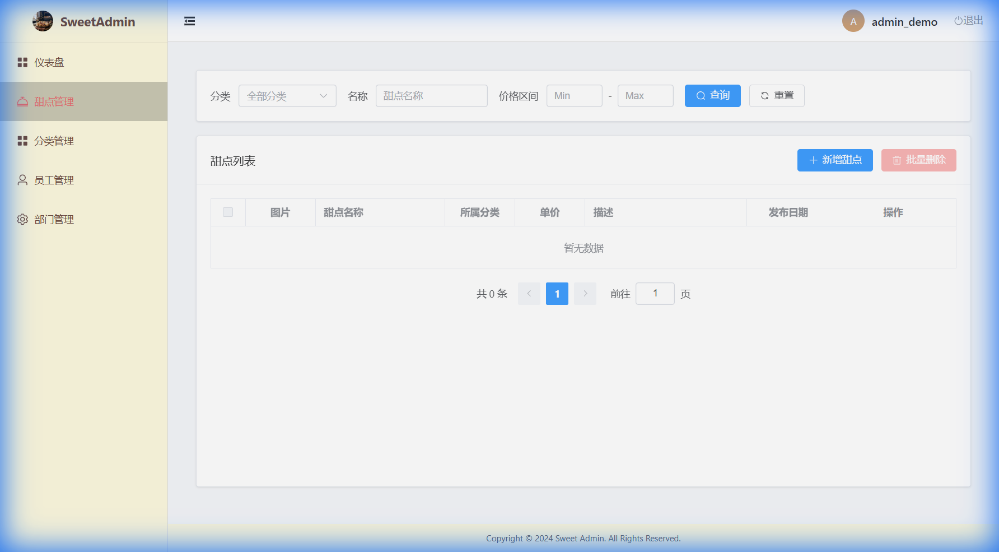
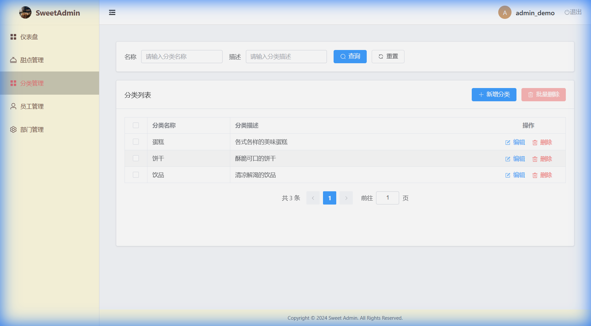
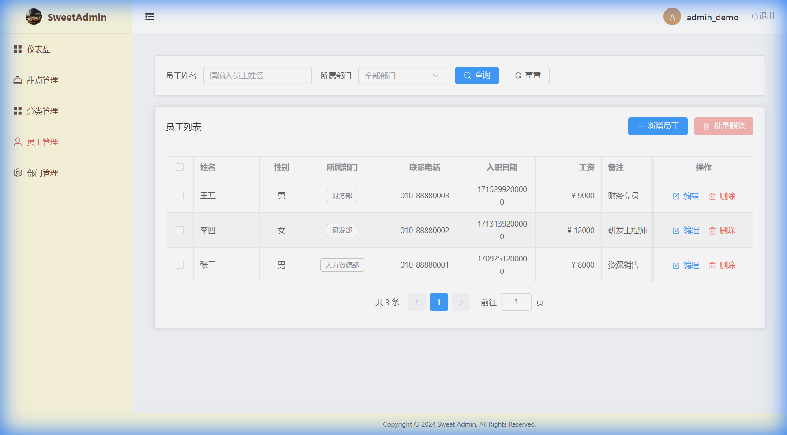
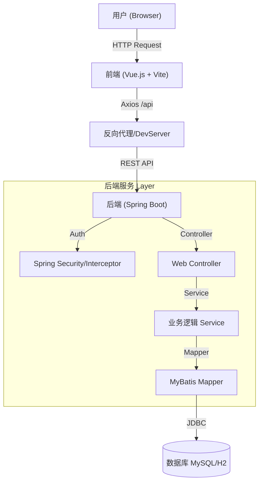
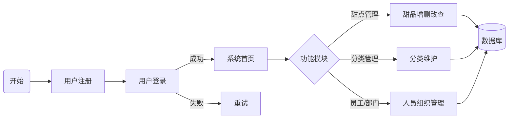

# 🍰 Dessert Management System (甜点信息管理系统)

[](LICENSE)
[](https://spring.io/projects/spring-boot)
[](https://vuejs.org/)

> A lightweight, modern dessert information management system suitable for small bakeries or cafes.  
> 一个轻量级、现代化的甜点信息管理系统，适用于小型烘焙店或咖啡馆的信息维护。

本仓库已进行**工程化重构**，支持 **H2 内存数据库一键启动**，无需安装 MySQL 即可快速体验！

---

## 🖼️ Project Demo (演示截图)

| 登录 (Login) | 注册 (Register) |
| :---: | :---: |
|  |  |

| 首页 (Dashboard) | 甜点列表 (Dessert List) |
| :---: | :---: |
|  |  |

| 分类管理 (Category) | 员工管理 (Employee) |
| :---: | :---: |
|  |  |

---

## 🛠️ Tech Stack (技术栈)

| Layer | Technology | Description |
| :--- | :--- | :--- |
| **Frontend** | Vue.js 3 | Progressive JavaScript Framework |
| | Vite 5 | Next Generation Frontend Tooling |
| | Element Plus | UI Component Library |
| | Axios | Promise based HTTP client |
| **Backend** | Java 17 | LTS Version |
| | Spring Boot 3.0.2 | Core Framework |
| | MyBatis 3.0 | ORM Framework |
| | H2 Database | In-memory Database (Default for Dev) |
| | MySQL 8.0 | Production Database (Optional) |
| **Tools** | Maven | Dependency Management |

---

## 🏗️ System Architecture (系统架构)



### 🧩 Core Business Process (核心流程)



---

## 🚀 Quick Start (快速开始)

### Prerequisites (环境要求)
- **Java**: JDK 17+
- **Node.js**: v16+
- **Database**: H2 (Built-in) or MySQL 8.0+

### 1. Clone Repository (克隆仓库)
```bash
git clone https://github.com/eastenzero/dessert-management.git
cd dessert-management
```

### 2. Backend Startup (启动后端)
The project is configured to use **H2 Database** by default for easy reproduction.
```bash
```bash
cd prj-backend
mvn spring-boot:run
```
*Backend will start at headers `http://localhost:8080`*

### 3. Frontend Startup (启动前端)
```bash
cd prj-fronted
npm install
npm run dev
```
*Frontend will start at `http://localhost:5173`*

### 4. Access System (访问系统)
- Open Browser: `http://localhost:5173`
- Default Account (Built-in):
  - Username: **admin**
  - Password: **123456** (Note: Built-in accounts may not work due to password encryption)
- **Recommendation**: Please register a new account on the login page to access the system.

---

## 🔌 API Overview (API 概览)

| Module | Endpoint | Method | Description |
| :--- | :--- | :--- | :--- |
| **Auth** | `/auth/login` | POST | User Login |
| | `/auth/register` | POST | User Registration |
| **Dessert** | `/dessert` | GET | List Desserts |
| | `/dessert` | POST | Add Dessert |
| | `/dessert` | PUT | Update Dessert |
| | `/dessert/{ids}` | DELETE | Delete Dessert(s) |
| **Category** | `/category` | GET | List Categories |
| **Employee** | `/employee` | GET | List Employees |

---

## ❓ FAQ (常见问题)

**Q: How to switch to MySQL? (如何切换到 MySQL?)**
A: Update `prj-backend/src/main/resources/application.properties`:
```properties
# Comment out H2 config
# spring.datasource.url=jdbc:h2:mem:desserts...

# Uncomment MySQL config
spring.datasource.url=jdbc:mysql://localhost:3306/desserts...
spring.datasource.username=root
spring.datasource.password=your_password
```
Ensure you run the SQL scripts in `sql/init.sql` (if created) or use the legacy `.sql` files in root.

**Q: Port 8080 is occupied? (端口及被占用?)**
A: Modify `server.port` in `application.properties`.

---

## 📅 Roadmap (后续规划)

- [x] Integrate H2 Database for quick start.
- [x] Refactor README and Documentation.
- [ ] Add JWT Authentication.
- [ ] Docker Support (Dockerfile & docker-compose).
- [ ] CI/CD Pipeline (GitHub Actions).

---

Based on the original work by eastenzero. Refactored for better developer experience.

---

## ✅ Documentation Fix Checklist (文档修复自检)

- [x] **Mermaid Rendering**: Fixed syntax for GitHub compatibility (quoted nodes).
- [x] **Auth Endpoints**: Corrected to `/auth/login` and `/auth/register` (verified in `AuthController.java`).
- [x] **Startup Command**: Removed `./mvnw` (wrapper missing), standardized on `mvn`.
- [x] **Default Account**: Added note about encryption/registering new account (verified `BCrypt` usage).
- [x] **Database**: Confirmed H2 default in `application.properties`.

